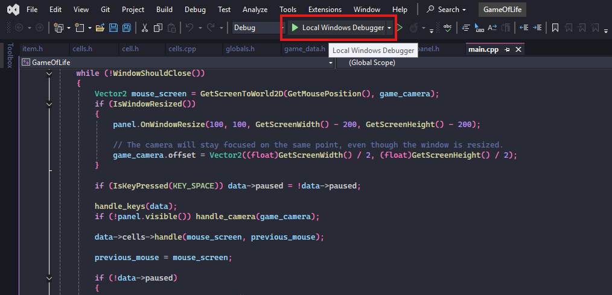

# Game Of Life

Conway's game of life in C++ with raylib... in a 100x100 grid!

So, as you can see... The first commit is "Change app  to MSVC.".. I force pushed, and lost the entire history of commits when changing app from Makefile to Windows-only.
...Whoops!
RIP 15 past commits :(

## Keybinds
Press Ctrl + K to open the keybind panel.

## Compiling and running.
### Using releases page (recommended)
Open the [releases page](https://github.com/EveMeows/GameOfLife), and download the zip file. Extract it, and run the game!

### Compiling (advanced)
I pre-package raylib (the graphics library used) inside the source code. All you need to do is have [Visual Studio 2022](https://visualstudio.microsoft.com/vs) installed. Make sure to have "Desktop development with C++" selected when installing, or modify your IDE accordingly.

Next, on the main menu of VS2022, click the "Clone a repository" button.

Fill in the details with the github repository link: "https://github.com/EveMeows/GameOfLife".

Once inside the project, you should see a window with a to of buttons. Click the "Local Windows Debugger" button, with the green arrow.

And that's it! You're ready to rock.

## Licenses
Project: MIT

Raylib: MIT